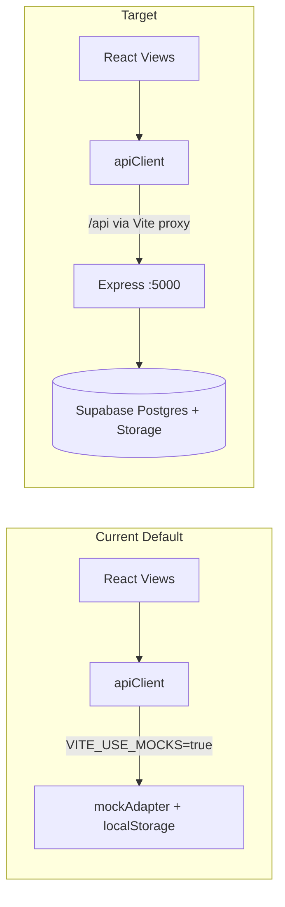
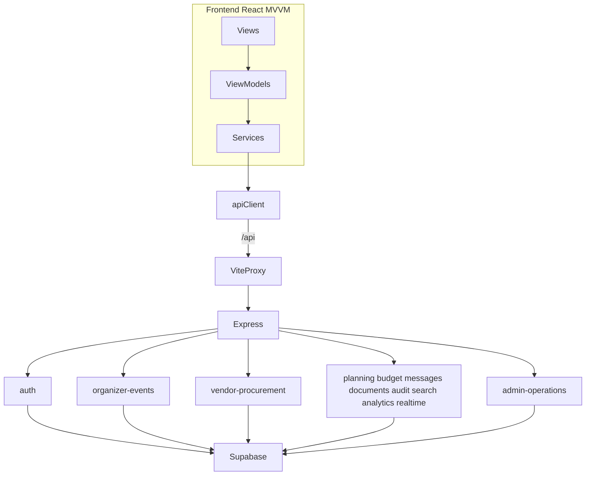

# Remove Demo Features and Wire Frontend to Backend

## Current State

Eventify is a monorepo with a **mock-first frontend** and a **production-shaped backend**:

**Problems blocking real integration today:**
- Mock mode is the default in [`frontend/src/config/env.ts`](frontend/src/config/env.ts) (`useMocks: true`)
- [`frontend/src/services/apiClient.ts`](frontend/src/services/apiClient.ts) short-circuits all requests through [`frontend/src/services/mock/mockAdapter.ts`](frontend/src/services/mock/mockAdapter.ts)
- Port mismatch: [`frontend/src/config/apiConfig.ts`](frontend/src/config/apiConfig.ts) falls back to `localhost:4000`, but backend + Vite proxy use **5000**
- **Login bug**: [`backend/src/auth/auth.service.js`](backend/src/auth/auth.service.js) line 55 calls `supabase.signInWithPassword` but only imports `supabaseAdmin` — login will fail at runtime
- 10 frontend-only services never call the API (planning, budget, availability, messaging, documents, audit, analytics, realtime, command search, help)
- Missing backend routes for auth refresh/logout, organizer profile, admin settings, and all Phase 6–8 endpoints

You chose: **full mock removal** + **implement missing backend endpoints** so existing UI keeps working.

---

## Phase 1 — Remove all demo/mock infrastructure (frontend)

### Delete files
- [`frontend/src/services/mock/`](frontend/src/services/mock/) — `mockAdapter.ts`, `mockData.ts`, `mockScenarios.ts`
- [`frontend/src/services/demoJourneyService.ts`](frontend/src/services/demoJourneyService.ts)
- [`frontend/src/shared/components/DemoRoleSwitcher.tsx`](frontend/src/shared/components/DemoRoleSwitcher.tsx)
- Demo docs: [`docs/FRONTEND_DEMO_GUIDE.md`](docs/FRONTEND_DEMO_GUIDE.md), [`docs/FRONTEND_DEMO_JOURNEYS.md`](docs/FRONTEND_DEMO_JOURNEYS.md), [`docs/FRONTEND_MOCK_MODE_GUIDE.md`](docs/FRONTEND_MOCK_MODE_GUIDE.md), [`docs/FRONTEND_MOCK_SCENARIOS.md`](docs/FRONTEND_MOCK_SCENARIOS.md)

### Simplify config and API client
- [`frontend/src/config/env.ts`](frontend/src/config/env.ts): remove `useMocks` / `apiMode`; keep `apiBaseUrl`, Supabase vars, app metadata
- [`frontend/src/config/apiConfig.ts`](frontend/src/config/apiConfig.ts): remove `isMockMode()`, `getApiMode()`; default `getApiBaseUrl()` to `/api` (works with Vite proxy in dev and reverse-proxy in prod)
- [`frontend/src/services/apiClient.ts`](frontend/src/services/apiClient.ts): remove mock import and interception block; always `fetch(getApiBaseUrl() + endpoint)`
- [`frontend/.env.example`](frontend/.env.example): set `VITE_API_BASE_URL=/api`, remove `VITE_USE_MOCKS`

### Remove UI references
- [`frontend/src/features/landing/views/LandingView.tsx`](frontend/src/features/landing/views/LandingView.tsx): remove demo panel / `DemoRoleSwitcher`
- [`frontend/src/shared/components/DashboardShell.tsx`](frontend/src/shared/components/DashboardShell.tsx): remove compact demo switcher
- [`frontend/src/features/auth/viewmodels/useAuthSession.ts`](frontend/src/features/auth/viewmodels/useAuthSession.ts): remove `demoJourneyService` and `DEMO_SESSION_EVENT` listener

### Clean placeholder copy (keep UI, remove “mock/demo” labels)
- [`frontend/src/shared/components/CommunicationComponents.tsx`](frontend/src/shared/components/CommunicationComponents.tsx): enable composer once messaging API exists
- [`frontend/src/shared/components/DocumentComponents.tsx`](frontend/src/shared/components/DocumentComponents.tsx): rename “Mock document upload” to real upload flow
- [`frontend/src/shared/components/AnalyticsComponents.tsx`](frontend/src/shared/components/AnalyticsComponents.tsx): wire to real analytics endpoint
- [`frontend/src/features/reports/viewmodels/useReports.ts`](frontend/src/features/reports/viewmodels/useReports.ts): replace PDF placeholder with real export endpoint or remove notice once backend PDF exists

### Update tests
- [`frontend/src/__tests__/Phase6Services.test.ts`](frontend/src/__tests__/Phase6Services.test.ts): rewrite to test API-backed services (mock `fetch` instead of mock adapter)
- Remove any remaining `isMockMode` / `mockUpload` references across `frontend/src`

---

## Phase 2 — Fix backend integration bugs

### Auth fix (critical)
In [`backend/src/auth/auth.service.js`](backend/src/auth/auth.service.js):
- Import `supabase` (anon client) from [`backend/src/config/supabase.js`](backend/src/config/supabase.js) for `signInWithPassword`
- Add `POST /auth/refresh` and `POST /auth/logout` in [`backend/src/auth/auth.routes.js`](backend/src/auth/auth.routes.js) using Supabase session refresh and sign-out

### Profile routes (frontend already calls these)
Add a new backend module (e.g. `backend/src/profiles/`) mounted in [`backend/src/app.js`](backend/src/app.js):

| Route | Maps to |
|-------|---------|
| `GET/PATCH /organizer/profile` | `organizer_profiles` table (same fields as onboarding) |
| `GET/PATCH /admin/settings` | `user_profiles` display_name + email from auth user |

Vendor profile already exists at `/vendor/profile` in [`backend/src/vendor-b2b-dashboard/`](backend/src/vendor-b2b-dashboard/).

### Add missing `backend/.env.example`
Document required vars: `SUPABASE_URL`, `SUPABASE_ANON_KEY`, `SUPABASE_SERVICE_ROLE_KEY`, `JWT_SECRET`, `PORT=5000`, `CLIENT_ORIGIN=http://localhost:5173`

---

## Phase 3 — Implement missing backend endpoints for Phase 6–8 UI

Port frontend logic into backend services and expose REST routes. Mount new routers in [`backend/src/app.js`](backend/src/app.js).

### A. Derived from existing data (no new tables)
| Endpoint | Backend logic | Frontend service to update |
|----------|---------------|---------------------------|
| `GET /events/:eventId/planning-timeline` | Port logic from [`frontend/src/services/planningService.ts`](frontend/src/services/planningService.ts) using portfolio query | Call `api.get` instead of local compute |
| `GET /events/:eventId/budget-center` | Port logic from [`frontend/src/services/budgetService.ts`](frontend/src/services/budgetService.ts) | Call `api.get` |
| `GET /admin/analytics/operations` | Port logic from [`frontend/src/services/analyticsService.ts`](frontend/src/services/analyticsService.ts); compute **real avg response time** from `booking_status_history.created_at` deltas | Call `api.get` |
| `GET /audit/activity?scope=` | Aggregate `booking_status_history`, `contract_status_history`, and recent notifications for the scope (event, booking, admin) | Call `api.get` |
| `GET /realtime/snapshot?channel=` | Return `{ connected: true, source: 'api', lastUpdatedAt, pendingSyncCount: 0 }` based on latest DB activity timestamp | Call `api.get` |
| `GET /search/global?q=` | Search user's events, vendors, bookings, notifications by title/name (role-scoped) | Call `api.get` in [`commandService.ts`](frontend/src/services/commandService.ts) |

### B. New database tables + migrations
Add [`database/migrations/0012_phase8_features.sql`](database/migrations/0012_phase8_features.sql) (and update [`database/migrations/00_full_migration.sql`](database/migrations/00_full_migration.sql)):

**`booking_messages`**
- Columns: `id`, `booking_id`, `author_user_id`, `type` (enum matching frontend), `body`, `created_at`
- RLS: organizer/vendor/admin participants on the booking can read; participants can post non-admin messages

**`document_metadata`**
- Columns: `id`, `owner_id` (event or user scope), `title`, `file_name`, `storage_path`, `state`, `uploaded_at`, `reviewed_at`, `notes`
- Tie into existing Supabase Storage bucket `vendor-documents` / `contracts` from [`database/migrations/0010_storage_policies.sql`](database/migrations/0010_storage_policies.sql)

**`vendor_blocked_dates`** (optional but needed for real availability UI)
- Columns: `id`, `vendor_id`, `date`, `reason`
- Seed blocked dates from accepted bookings overlapping event dates

| Endpoint | Implementation |
|----------|----------------|
| `GET /documents?ownerId=` | List from `document_metadata` |
| `POST /documents/upload` | Multipart upload → Supabase Storage + metadata row |
| `GET /bookings/:bookingId/messages` | List messages + system entries from booking history |
| `POST /bookings/:bookingId/messages` | Create message (enable composer in UI) |
| `GET /vendors/:vendorId/availability` | Combine `vendor_services.availability_status`, blocked dates, booking conflicts |
| `GET/PATCH /vendor/availability` | Vendor’s own availability status + blocked dates |

### C. Reports / PDF
Reports already assemble from real API data in [`useReports.ts`](frontend/src/features/reports/viewmodels/useReports.ts). Add:
- `GET /reports/:role` — optional server-side bundle (same shape as `ReportBundle`) for consistency
- `POST /reports/:role/export` — CSV stream (or keep client CSV and add `POST /reports/:role/pdf` returning a generated PDF buffer using a lightweight lib like `pdfkit`)

---

## Phase 4 — Rewire frontend services to API

Replace in-memory implementations with `apiClient` calls in:

| Service file | Change |
|--------------|--------|
| [`planningService.ts`](frontend/src/services/planningService.ts) | `GET /events/:eventId/planning-timeline` |
| [`budgetService.ts`](frontend/src/services/budgetService.ts) | `GET /events/:eventId/budget-center` |
| [`availabilityService.ts`](frontend/src/services/availabilityService.ts) | vendor availability endpoints |
| [`communicationService.ts`](frontend/src/services/communicationService.ts) | booking messages GET/POST |
| [`documentService.ts`](frontend/src/services/documentService.ts) | documents list + upload (rename `mockUpload` → `uploadDocument`) |
| [`auditService.ts`](frontend/src/services/auditService.ts) | `GET /audit/activity` |
| [`analyticsService.ts`](frontend/src/services/analyticsService.ts) | `GET /admin/analytics/operations` |
| [`realtimeService.ts`](frontend/src/services/realtimeService.ts) | `GET /realtime/snapshot`; set `source: 'api'` |
| [`commandService.ts`](frontend/src/services/commandService.ts) | `GET /search/global`; keep static quick actions (role-based nav links are fine) |
| [`helpService.ts`](frontend/src/services/helpService.ts) | Keep static help copy (not demo data — no backend needed) |

Update viewmodels that call renamed methods:
- [`useEventPortfolio.ts`](frontend/src/features/contract-booking/viewmodels/useEventPortfolio.ts): `mockUploadDocument` → `uploadDocument`
- [`useAdminDashboard.ts`](frontend/src/features/admin-operations/viewmodels/useAdminDashboard.ts), [`useVendorB2BDashboard.ts`](frontend/src/features/vendor-b2b-dashboard/viewmodels/useVendorB2BDashboard.ts), [`useVendorProcurement.ts`](frontend/src/features/vendor-procurement/viewmodels/useVendorProcurement.ts)

Update [`frontend/src/services/apiContracts.ts`](frontend/src/services/apiContracts.ts) statuses from `mock` → `live`.

---

## Phase 5 — Environment, docs, and verification

### Local dev setup (document in README)
1. Run Supabase migrations (`database/migrations/00_full_migration.sql` or 0001–0012 sequentially)
2. Optionally run [`database/seed.sql`](database/seed.sql) with real Supabase auth user UUIDs aligned to seed data
3. Backend: `backend/.env` with Supabase credentials → `npm run dev` on port 5000
4. Frontend: `frontend/.env` with `VITE_API_BASE_URL=/api` → `npm run dev` on port 5173 (Vite proxies `/api` → backend)

### Verification checklist
Run through each role after changes:

| Flow | Validates |
|------|-----------|
| Register → choose role → onboarding | Auth + profile routes |
| Organizer: create event → add requirements → search vendors → create booking | Core procurement API |
| Organizer: portfolio tabs (timeline, budget, documents, activity, messages) | New Phase 8 endpoints |
| Vendor: booking queue → accept/reject → contract sign | B2B + contracts |
| Admin: dashboard analytics, vendor verification, audit timeline | Admin + analytics + audit |
| Notifications center | Existing notifications API |
| Reports CSV/print/PDF | Reports export |
| Command palette search | Global search endpoint |
| Logout + session refresh | Auth refresh/logout |

Also run existing Vitest suite and hit `GET /health` to confirm backend is reachable through the proxy.

### Docs cleanup
- Update [`README.md`](README.md) and [`docs/FRONTEND_API_CONTRACTS.md`](docs/FRONTEND_API_CONTRACTS.md): remove mock-mode sections, document new endpoints
- Keep [`database/seed.sql`](database/seed.sql) as optional dev seed (not shipped in UI)

---

## Architecture After Changes

---

## Risk Notes

- **Scope is large** (~15 new endpoints + 2–3 DB tables + full mock removal). Work should proceed backend-first so frontend rewiring has stable contracts.
- **Supabase setup is required** — the app cannot run without valid backend `.env` and applied migrations.
- **Contract creation role** is correctly `organizer, admin` on backend; frontend contract service already matches — no change needed.
- **`helpService` static content** and **UI placeholder images** (`PlaceholderMedia`, `ChooseRoleView` SVG previews) are not demo/mock infrastructure — keep them.
